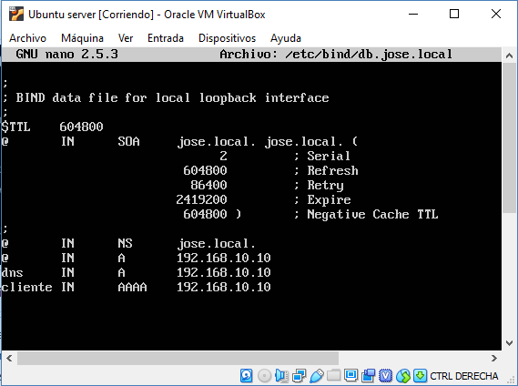

# Manual dns directo e inverso ubuntu server

## Sistema de nombres de dominio

El sistema de nombres de dominio (Domain Name System o DNS, por sus siglas en inglés) es un sistema de nomenclatura 
jerárquico descentralizado para dispositivos conectados a redes IP como Internet o una red privada.
 
Este sistema asocia información variada con nombre de dominio asignado a cada uno de los participantes. 

Su función más importante es "traducir" nombres inteligibles para las personas en identificadores binarios asociados 
con los equipos conectados a la red, esto con el propósito de poder localizar y direccionar estos equipos mundialmente.
[Más información.](https://es.wikipedia.org/wiki/Sistema_de_nombres_de_dominio)

## Actualización

Primeramente hay que configurar el servidor con una IP estática. Usando el comando ***`nano etc/network/interfaces`*** 
accedemos al archivo interfaces para añadir los parámetros de la conexión estática.

Antes de iniciar el proceso de instalación hay que actualizar los respositorios de nuestro sistema Ubuntu server.
Para ello utilizaremos el comando ***`sudo apt update`***.

## Instalación del servicio Bind9

Para iniciar la instalación del servicio DNS deberemos ejecutar el comando ***`sudo apt-get install bind9`***

## Configuración de las zonas

Posteriormente procederemos a editar el primer fichero ***`sudo nano /etc/bind/named.conf.local`***. En él definiremos 
las zonas directa e inversa.

    Como se observa yo he comentado las zonas que he configurado, 
    para que sea más visible. En zone he puesto el nombre de la zona, en la directa el dominio y en la inversa la Id de red
    al revés y añadiendo el .in.adr.arpa . El type en las dos debe ser master, ya que son zonas principales. 
    En file ponemos la dirección y nombre del fichero, hay que acordarse de poner db.nombre_zona .

Definidas las zonas, hay que proceder a chequear que se haya editado correctamente el fichero sin errores de sintaxis.
Para ello hay que utilizar el comando ***`sudo named-checkconf /etc/bind/named.conf.local`***. Si tras ejecutar el comando
no hace nada, significa que no hay ningún error.

## Configuración BD
Chequeado el paso anterior se procede a crear los ficheros de zona que hemos indicado en el paso anterior. 
Para su creación vamos a tomar como plantillas ficheros de zonas que se crean al instalar el paquete bind9 y 
los editaremos. Para la zona directa crearemos el fichero ***`/etc/bind/db.midominio.local`***. Para ello utilizaremos
el comando ***`sudo cp /etc/bind/db.local /etc/bind/db.midominio.local`***

Una vez creado el fichero lo editaremos y cambiaremos/añadiremos el nombre del dominio y las entidades  por las nuestras.
Para ello utilizaremos el comando ***`sudo nano /etc/bind/db.midominio.local`***

     Este fichero vendrá relleno y solo tendremos que cambiar los parametros por los nuestros. El SOA determina el 
    propietario de la zona, pondríamos el nombre de nuestra zona, en mi caso 
    (jose.local.). Los números que nos aparecen son parámetros. El NS sería 
    nuestro servidor autorizado, en el A ponemos nuestro host y su IP. En éste caso pondremos dos host (A), el servidor 
    y cliente, con sus respectivas direcciones IP. La AAAA es el host de IPv6, con lo cual lo dejamos tal cual está sin
     configurar.

Nuevamente procederemos a chequear que hayamos realizado correctamente esta paso anterior y asegurarnos que no hayamos
cometido nigún error de sintaxis. 
Para ello utilizaremos ***`sudo named-checkconf midominio.local /etc/bind/db.midominio.local`***

A continuación añadiremos registros a la zona inversa. Para ello utilizaremos el comando
 ***`sudo nano /etc/bind/db.tudireccion`***
 

    Nos encontramos con el SOA explicado anteriormente en el que realizamos mismo proceso. En el NS ponemos nuestro 
    servidor fuertemente cualificado, y en el PTR la IP del host al revés y añadiendo .in-addr.arpa. y nuestro host. 
    

## Reiniciamos el servcicio

Con el comando***`/etc/init.d/bind9 restart`***reiniciamos el servicio.

